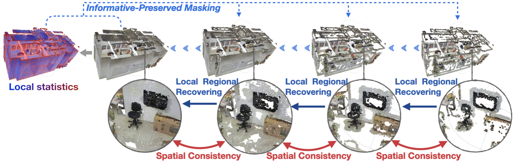

# MM-3DScene: 3D Scene Understanding by Customizing Masked Modeling with Informative-Preserved Reconstruction and Self-Distilled Consistency


This repository is built for the official implementation of:

__MM-3DScene__: 3D Scene Understanding by Customizing Masked Modeling with Informative-Preserved Reconstruction and Self-Distilled Consistency ___(CVPR2023)___ [[arXiv](https://arxiv.org/abs/2212.09948)],

by [Mingye Xu*](https://mingyexu.github.io/), [Mutian Xu*](https://mutianxu.github.io/), [Tong He](https://tonghe90.github.io/), [Wanli Ouyang](https://wlouyang.github.io/), [Yali Wang†](https://scholar.google.com/citations?user=hD948dkAAAAJ), [Xiaoguang Han](https://sse.cuhk.edu.cn/en/faculty/hanxiaoguang), [Yu Qiao†](http://mmlab.siat.ac.cn/yuqiao).
<br>

## Introduction
Masked Modeling (MM) has demonstrated widespread success in various vision challenges, by reconstructing masked visual patches. Yet, applying MM for large-scale 3D scenes remains an open problem due to the data sparsity and scene complexity. The conventional random masking paradigm used in 2D images often causes a high risk of ambiguity when recovering the masked region of 3D scenes.

To this end, we propose a novel informative-preserved reconstruction, which explores local statistics to discover and preserve the representative structured points, effectively enhancing the pretext masking task for 3D scene understanding. Integrated with a progressive reconstruction manner, our method can concentrate on modeling regional geometry and enjoy less ambiguity for masked reconstruction. Besides, such scenes with progressive masking ratios can also serve to self-distill their intrinsic spatial consistency, requiring to learn the consistent representations from unmasked areas. By elegantly combining informative-preserved reconstruction on masked areas and consistency self-distillation from unmasked areas, a unified framework called MM-3DScene is yielded.

We conduct comprehensive experiments on a host of downstream tasks. The consistent improvement (e.g., +6.1% mAP@0.5 on object detection and +2.2% mIoU on semantic segmentation) demonstrates the superiority of our approach.


## Usage

The codes and model zoos can be found in the folders of corresponding tasks.

For detection, follow the [README](https://github.com/MingyeXu/mm-3dscene/detection/README.md) under the `detection` folder.

For segmentation, follow the [README](https://github.com/MingyeXu/mm-3dscene/blob/main/segmentation/README.md) under the `segmentation` folder.


## Citing our work

If you use this code, please consider citing:
```
@inproceedings{xu2023mm3dscene,
  title={MM-3DScene: 3D Scene Understanding by Customizing Masked Modeling with Informative-Preserved Reconstruction and Self-Distilled Consistency},
  author={Xu, Mingye and Xu, Mutian and He, Tong and Ouyang, Wanli and Wang, Yali and Han, Xiaoguang and Qiao, Yu},
  booktitle={CVPR},
  year={2023}
}
```


## Contact

You are welcome to send pull requests or share some ideas with us. Contact information: Mingye Xu (my.xu@siat.ac.cn) or Mutian Xu (mutianxu@link.cuhk.edu.cn).


## Acknowledgement

We include the following libraries and algorithms:  
[1] [CD](https://github.com/ThibaultGROUEIX/ChamferDistancePytorch)  
[2] [PointTransformer](https://github.com/POSTECH-CVLab/point-transformer)   
[3] [VoteNet](https://github.com/facebookresearch/votenet)
